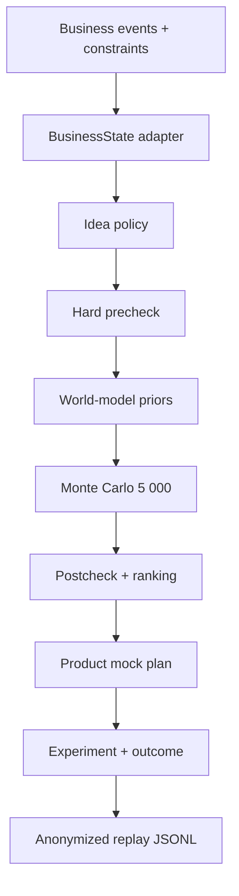

# Архитектура MVP

Один синхронный FastAPI-монолит сохраняет весь golden path воспроизводимым и доступным без внешней LLM.

## Доверенные границы

- `BusinessStateAdapter` — единственное место, которое читает transaction fixture. Наружу выходят только агрегаты с provenance.
- `HardPrecheck` — выше model providers; LLM не может отменить `NEED_DATA` или `BLOCK`.
- `TemplateWorldModel`/`LLMWorldModel` — только распределения и допущения.
- `MonteCarloSimulator` — вся арифметика и seed-based воспроизводимость.
- `ProductGateway` — проверяет каждый `product_id` по каталогу и ничего не запускает без подтверждения.
- `ExperimentService` — сохраняет state/action/forecast/outcome/reward без raw transactions и персональных данных.

## Хранение

Контракт ограничен 11 таблицами: `businesses`, `business_events`, `metric_snapshots`, `decision_requests`, `sprint_candidates`, `simulation_runs`, `experiments`, `experiment_outcomes`, `knowledge_items`, `alfa_products`, `model_versions`.

SQLite — zero-setup fallback. Docker Compose запускает PostgreSQL 16 и применяет Alembic migration перед стартом API.

